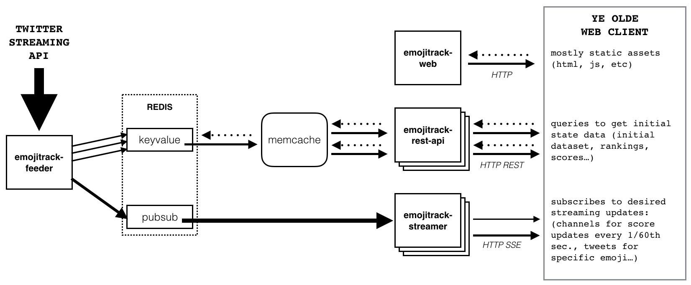

# Emojitracker :dizzy:

> Emojitracker.com tracks realtime emoji usage on Twitter.

Emojitracker is a complex project with a service-oriented architecture, and thus
has now been split up into multiple repositories.  This repository mainly just
serves as table of contents of sorts. Major components of the project are listed
below.

## Architecture

Bad and somewhat outdated diagram of how the main parts fit together in production:

## Core Applications

The core applications of Emojitracker. Note that while these are open source for
educational purposes, they are currently **all rights reserved**. Please contact
me directly if you want to use them for something.

- **[emojitrack-web]**         _Web frontend and application server._
- **[emojitrack-feeder]**      _Consumes the Twitter Streaming API and feeds our data pipeline._
- **[emojitrack-gostreamer]**  _Handles streaming updates to clients via SSE._
- **[emojitrack-stream-spec]** _Defines the Streaming API spec & tests servers in staging._
- **[emojitrack-rest-api]**    _Defines and powers the REST API._
- **[emojitrack-fakefeeder]**  _Aides Emojitracker local development by emulating Feeder locally._

The core applications are now mostly located in the [Emojitracker GitHub
Organization](https://github.com/emojitracker), including some old deprecated
stuff not mentioned above.

[emojitrack-web]:         https://github.com/emojitracker/emojitrack-web
[emojitrack-feeder]:      https://github.com/emojitracker/emojitrack-feeder
[emojitrack-gostreamer]:  https://github.com/emojitracker/emojitrack-gostreamer
[emojitrack-stream-spec]: https://github.com/emojitracker/emojitrack-streamer-spec
[emojitrack-rest-api]:    https://github.com/emojitracker/emojitrack-rest-api
[emojitrack-fakefeeder]:  https://github.com/emojitracker/emojitrack-fakefeeder

## Libraries and Tools

**Most of the generalizable and useful pieces of Emojitracker have been carved out
into maintained open-source libraries.  These libraries are all freely
licensed** (see individual repositories for details).

### Emoji Encoding

- **[emoji_data.rb]**
  _Utility library for handling the Emoji vs Unicode nightmare (Ruby)._
- **[emoji-data-js]**
  _Utility library for handling the Emoji vs Unicode nightmare (NodeJS port)._
- **[exmoji]**
  _Utility library for handling the Emoji vs Unicode nightmare (Elixir/Erlang port)._

[emoji_data.rb]: https://github.com/mroth/emoji_data.rb
[emoji-data-js]: https://github.com/mroth/emoji-data-js
[exmoji]:        https://github.com/mroth/exmoji

### Emoji Assets

- **[emojistatic]**
  _Generates static Emoji assets for a public CDN._
- **[cssquirt]**
  _Embeds images (or directories of images) directly into CSS via the Data URI scheme._

[emojistatic]:   https://github.com/mroth/emojistatic
[cssquirt]:      https://github.com/mroth/cssquirt

### Streaming

- **[sseserver]**
  _High-performance Server-Sent Events endpoint for Go._
- **[sse-bench]**
  _Benchmarks and load tests Server-Sent Events endpoints._

[sseserver]: https://github.com/mroth/sseserver
[sse-bench]: https://github.com/mroth/sse-bench

## The Emojitracker APIs

Emojitracker also provides a [REST API][rest-api] and [Streaming API][stream-api].

By using the Emojitracker APIs, you agree to adhere to the [Emojitracker API
Terms of Use][tou] as well as the [Code of Conduct][coc].

[rest-api]:   https://github.com/emojitracker/emojitrack-rest-api
[stream-api]: https://github.com/emojitracker/emojitrack-streamer-spec
[tou]:        https://github.com/mroth/emojitracker/TERMS_OF_USE.md
[coc]:        https://github.com/mroth/emojitracker/CODE_OF_CONDUCT.md

## Other Information

The narrative version of how version 1.0 of this project was built is in the
Medium post ["How I Built Emojitracker"][essay], and the followup ["How I Kept
Building Emojitracker"][essay2].  Note however, both are now quite out of date,
and do not reflect a substantial amount of change over the past few years.

[essay]: https://medium.com/@mroth/how-i-built-emojitracker-179cfd8238ac
[essay2]: https://medium.com/@mroth/how-i-kept-building-emojitracker-c31378810136
